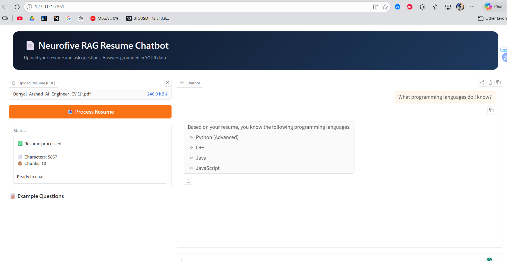

```markdown
<p align="center">
  
  
  
  
  
</p>

<h1 align="center">📄 Neurofive Solutions RAG Resume Chatbot</h1>

<p align="center">
  <b>Week 2 Internship Project — Retrieval-Augmented Generation (RAG)</b><br>
  Chat with your own resume using AI-powered document grounding.
</p>

<p align="center">
  <a href="#-what-is-rag">What is RAG</a> •
  <a href="#-features">Features</a> •
  <a href="#-demo-screenshots">Screenshots</a> •
  <a href="#-tech-stack">Tech Stack</a> •
  <a href="#-installation">Installation</a> •
  <a href="#-usage">Usage</a> •
  <a href="#-testing">Testing</a>
</p>

---

## 🎯 What is RAG?

**Retrieval-Augmented Generation (RAG)** is the technology behind every "Chat with your PDF" tool. Instead of AI guessing from its training data, RAG:

1. **📖 Reads** your document
2. **✂️ Chunks** it into searchable pieces
3. **🔢 Embeds** chunks into vectors using AI
4. **🗂️ Stores** vectors in a fast search database (FAISS)
5. **🔍 Retrieves** only relevant chunks for each question
6. **🤖 Answers** using ONLY your document content

> **Result:** 100% grounded answers. No hallucinations.

---

## 📸 Demo Screenshots

### 🌐 Web Dashboard — Upload & Process Resume
<p align="center">
  
</p>
<p align="center"><i>Upload your PDF resume and click "Process Resume" to build the vector index</i></p>

---

---
## ✨ Features

| Feature | Description |
|:---|:---|
| 📄 **PDF Ingestion** | Extract text from any PDF resume |
| 🔢 **AI Embeddings** | Google Gemini `embedding-001` for semantic search |
| 🗂️ **FAISS Vector Store** | Lightning-fast similarity search |
| 💬 **Streaming Chat** | Real-time responses in Gradio web UI |
| 🎯 **Context Grounding** | Answers only from your document |
| 🛡️ **Hallucination Guard** | Refuses to answer when info is missing |
| 📝 **Quick Examples** | One-click test questions |
| 🎨 **Professional UI** | Neurofive branded dark theme |

---

## 🛠️ Tech Stack

| Technology | Purpose |
|:---|:---|
| **Python 3.10+** | Core language |
| **Google Gen AI SDK** (`google-genai`) | Gemini API for chat & embeddings |
| **Gradio 6.0** | Professional web interface |
| **FAISS-CPU** | Vector similarity search |
| **PyPDF2** | PDF text extraction |
| **python-dotenv** | Secure API key management |
| **NumPy** | Vector operations |

---

## 📦 Installation

### Prerequisites
- Python 3.10 or higher
- Free [Google AI Studio API Key](https://aistudio.google.com/app/apikey)

### Step 1: Clone the Repository
```bash
git clone https://github.com/yourusername/neurofive-rag-resume.git
cd neurofive-rag-resume
```

### Step 2: Create Virtual Environment
```bash
python -m venv venv

# Windows
venv\Scripts\activate

# macOS/Linux
source venv/bin/activate
```

### Step 3: Install Dependencies
```bash
pip install -r requirements.txt
```

### Step 4: Configure API Key
```bash
# Windows
copy .env.example .env
notepad .env
```
Add your Gemini API key:
```env
GEMINI_API_KEY=AIzaSyYourActualKeyHere
```

---

## 🚀 Usage

### 🌐 Run the Web Dashboard
```bash
python rag_app.py
```
Opens automatically at: `http://127.0.0.1:7861`

### 💻 Run the CLI Version
```bash
python rag_chatbot.py
```

---

## 🧪 Testing

Upload your resume and try these questions:

| # | Question | Expected Result |
|:---|:---|:---|
| 1 | "What is my highest education?" | Correct degree/university from resume |
| 2 | "What programming languages do I know?" | Only languages listed in resume |
| 3 | "What was my last job role?" | Most recent position |
| 4 | "Do I have any certifications?" | Certifications or "not found" |
| 5 | "What projects have I worked on?" | Projects from resume |
| 6 | 🚨 **"What is my favorite hobby?"** | **Should refuse** — hallucination test |

---

---

## 🔒 Security

- ✅ API key loaded from `.env` — never hardcoded
- ✅ `.env` listed in `.gitignore` — never committed
- ✅ No sensitive data in screenshots (blur API keys if visible)

---

## 🐛 Troubleshooting

| Issue | Solution |
|:---|:---|
| `GEMINI_API_KEY not found` | Create `.env` file with your API key |
| `models/embedding-001 is not found` | Use `embedding-001` (not `text-embedding-004`) |
| `ModuleNotFoundError` | Run `pip install -r requirements.txt` |
| `Port 7861 in use` | Change `server_port` in `rag_app.py` |

---

## 📄 License

MIT License — free to use, modify, and distribute.

---

## 👤 Author

**Neurofive Solutions Intern**  
Week 2 Task — RAG & Document Grounding  
Built with ❤️ using Python, Gradio, FAISS & Google Gemini

---

<p align="center">
  <sub>⭐ Star this repo if you found it helpful!</sub>
</p>
```

---

