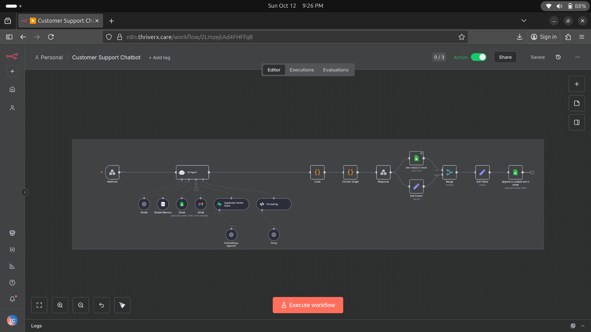

# 🤖 N8N RAG Agent — AI-Powered Knowledge & Lead Automation

> An end-to-end **Retrieval-Augmented Generation (RAG) AI Agent** built with **n8n, LangChain, OpenAI, and Supabase Vector Store** for intelligent conversations, knowledge retrieval, lead capture, and business workflow automation.



---

## 📌 Overview

**N8N RAG Agent** is a production-oriented AI automation workflow that combines conversational AI with Retrieval-Augmented Generation (RAG) and business automation.

The system enables an AI agent to:

- Understand and respond to user queries
- Retrieve relevant information from a company knowledge base
- Maintain short-term conversational context
- Capture and store qualified leads
- Send automated email notifications
- Expose the agent through a REST-style webhook API
- Integrate with external business tools through n8n

The architecture demonstrates how modern **LLM + RAG + workflow automation** technologies can be combined to build practical AI assistants.

---

## ✨ Key Features

### 🧠 Conversational AI

- OpenAI GPT models integrated through n8n/LangChain
- Context-aware conversations using memory
- Custom system prompts for controlled AI behavior
- Concise and structured responses
- User-specific conversation sessions

### 🔎 Retrieval-Augmented Generation

- Supabase Vector Store integration
- Semantic retrieval from uploaded knowledge documents
- Context injection into the AI Agent
- Knowledge-grounded responses
- Reduced dependency on the model's internal knowledge

### 📊 Automated Lead Capture

The agent can collect important lead information such as:

- Name
- Email address
- Conversation history

Captured information can be automatically stored in **Google Sheets** for further processing.

### 📧 Automated Notifications

When a qualified lead is captured, the workflow can automatically trigger a Gmail notification for the relevant team.

### 🌐 Webhook API

The workflow exposes an n8n webhook endpoint that allows external applications, websites, or chat interfaces to communicate with the AI agent.

Example request:

```bash
curl -X POST https://your-n8n-domain/webhook/your-webhook-id \
  -H "Content-Type: application/json" \
  -d '{
    "body": {
      "message": "What programs do you offer?",
      "user_id": "user_123"
    }
  }'


---

🏗️ System Architecture

┌──────────────────┐
                    │   Chat / Client  │
                    └────────┬─────────┘
                             │
                             ▼
                    ┌──────────────────┐
                    │     Webhook      │
                    └────────┬─────────┘
                             │
                             ▼
                    ┌──────────────────┐
                    │ Conversation     │
                    │ Memory           │
                    └────────┬─────────┘
                             │
                             ▼
             ┌──────────────────────────────┐
             │          AI Agent            │
             │     OpenAI + LangChain       │
             └──────────────┬───────────────┘
                            │
             ┌──────────────┴──────────────┐
             ▼                             ▼
    ┌──────────────────┐          ┌──────────────────┐
    │ Supabase Vector  │          │ Business Tools   │
    │ Store / RAG      │          │                  │
    └──────────────────┘          │ Google Sheets    │
                                  │ Gmail            │
                                  └──────────────────┘
                            │
                            ▼
                    ┌──────────────────┐
                    │ Response         │
                    │ Formatter        │
                    └────────┬─────────┘
                             │
                             ▼
                    ┌──────────────────┐
                    │ Respond to       │
                    │ Webhook          │
                    └──────────────────┘


---

🔄 Workflow

The core workflow follows this pipeline:

User Message
     ↓
Webhook
     ↓
Session / Memory
     ↓
AI Agent
     ↓
Knowledge Retrieval
     ↓
Supabase Vector Store
     ↓
Relevant Context
     ↓
LLM Response Generation
     ↓
Response Formatting
     ↓
Respond to Webhook

When required, the AI Agent can also interact with business tools:

AI Agent
   ├── Google Sheets → Store Lead
   │
   └── Gmail → Notify Team


---

🧩 Core n8n Components

Component	Purpose

Webhook	Receives user messages from external applications
AI Agent	Controls reasoning, tool usage, and responses
OpenAI Chat Model	Generates natural-language responses
Memory	Maintains short-term conversation context
Supabase Vector Store	Stores and retrieves knowledge embeddings
Google Sheets	Stores captured lead information
Gmail	Sends automated notifications
Code / Formatter Nodes	Cleans and structures workflow data
Respond to Webhook	Returns the final response to the client


---

🔎 RAG Pipeline

The Retrieval-Augmented Generation pipeline works as follows:

1. User Query

The user submits a question through the chat interface.

2. Query Processing

The workflow extracts and processes the user's message.

3. Knowledge Retrieval

The system searches the Supabase Vector Store for semantically relevant documents.

4. Context Injection

Relevant document content is provided to the AI Agent as contextual information.

5. Response Generation

The LLM generates a response based on the retrieved knowledge and conversation context.

User Question
      ↓
Query
      ↓
Vector Search
      ↓
Relevant Documents
      ↓
Context
      ↓
AI Agent
      ↓
Grounded Response


---

📈 Lead Capture Workflow

The agent can also function as an automated lead-generation assistant.

User Conversation
       ↓
Identify Lead Intent
       ↓
Collect Name + Email
       ↓
Google Sheets
       ↓
Store Lead Information
       ↓
Gmail Notification

This allows businesses to combine customer support and lead generation within a single AI workflow.


---

⚙️ Setup & Installation

1. Prerequisites

Before running the workflow, make sure you have:

n8n installed locally or through Docker

OpenAI API access

Supabase project

Google account for Sheets/Gmail integrations

Imported n8n workflow JSON


---

2. Clone the Repository

git clone https://github.com/alihassanml/n8n-rag-agent.git

cd n8n-rag-agent

> Replace the repository URL with the actual repository URL if different.


---

3. Run n8n with Docker

docker run -d \
  --name n8n \
  -p 5678:5678 \
  -v ~/.n8n:/home/node/.n8n \
  n8nio/n8n

Open n8n in your browser:

http://localhost:5678


---

📥 Import the Workflow

1. Open your n8n dashboard.


2. Select Import from File.


3. Choose the workflow JSON file from this repository.


4. Import the workflow.


5. Configure the required credentials.


6. Activate the workflow.


---

🔐 Configuration

Configure the following services inside n8n.

OpenAI

Add your OpenAI credentials to the relevant AI nodes.

Supabase

Configure:

SUPABASE_URL
SUPABASE_API_KEY

Then connect the Supabase Vector Store node to your knowledge base.

Google Sheets

Authenticate your Google account and select the spreadsheet used for lead storage.

Gmail

Authenticate Gmail OAuth2 and configure the notification workflow.

> Security: Never commit API keys, OAuth credentials, .env files, or other secrets to GitHub.


---

🗂️ Knowledge Base

You can customize the RAG knowledge base with:

Company documentation

FAQs

Product information

Service descriptions

Pricing information

Internal documentation

Support articles


The documents should be processed and stored as embeddings in the Supabase Vector Store.


---

💼 Example Use Case

ThriveRx Virtual Assistant

This workflow can be adapted into a virtual assistant for a wellness or healthcare-oriented business.

Customer Support

Answer frequently asked questions

Retrieve information from company documentation

Maintain conversation context


Lead Generation

Identify interested users

Collect contact information

Store leads automatically


Business Automation

Update Google Sheets

Notify staff through Gmail

Connect the AI assistant to an external website


> For healthcare deployments, the workflow should be appropriately secured and designed to avoid providing unsafe or unauthorized medical advice.


---

🛠️ Technology Stack

Technology	Role

n8n	Workflow orchestration and automation
LangChain	AI/LLM orchestration
OpenAI	Large Language Model
Supabase	Vector database and backend services
Google Sheets	Lead management
Gmail API	Automated notifications
REST Webhooks	External application integration
Docker	Containerized deployment


---

🎯 Real-World Applications

This architecture can be adapted for:

🤝 Customer support assistants

📚 Internal knowledge assistants

🎯 Lead-generation agents

🏢 Business information assistants

🛒 E-commerce support

📧 Sales automation

📖 Documentation assistants

⚙️ AI-powered workflow automation


---

🔒 Security Considerations

For production deployment:

Store credentials using n8n's credential management.

Never expose API keys in workflow code.

Validate incoming webhook requests.

Add authentication to public endpoints.

Apply rate limiting where appropriate.

Sanitize user-provided input.

Restrict access to sensitive business data.

Use appropriate logging and monitoring.


---

🚀 Future Improvements

[ ] Streaming AI responses

[ ] Long-term conversation memory

[ ] Multi-user session management

[ ] Authentication and authorization

[ ] RAG evaluation and retrieval metrics

[ ] Hybrid search

[ ] Re-ranking retrieved documents

[ ] Conversation analytics dashboard

[ ] CRM integration

[ ] WhatsApp / Telegram integration

[ ] Human-in-the-loop escalation

[ ] Automated document ingestion pipeline


---

📂 Project Structure

n8n-rag-agent/
│
├── workflow/
│   └── rag-agent.json
│
├── assets/
│   └── image.png
│
├── docs/
│   └── knowledge-base.md
│
├── .gitignore
├── LICENSE
└── README.md


---

👨‍💻 Author

Ali Hassan

BS Computer Science | AI & Data Science Enthusiast

GitHub: alihassanml


---

📄 License

This project is released under the MIT License.

See the LICENSE file for more information.


---

🤝 Contributing

Contributions are welcome.

If you find a bug, have an improvement idea, or want to extend the workflow:

1. Fork the repository


2. Create a new branch


3. Make your changes


4. Commit your changes


5. Open a Pull Request


---

⭐ Support

If you find this project useful, consider giving the repository a ⭐ on GitHub.

For questions or improvements, feel free to open an issue or submit a pull request.
