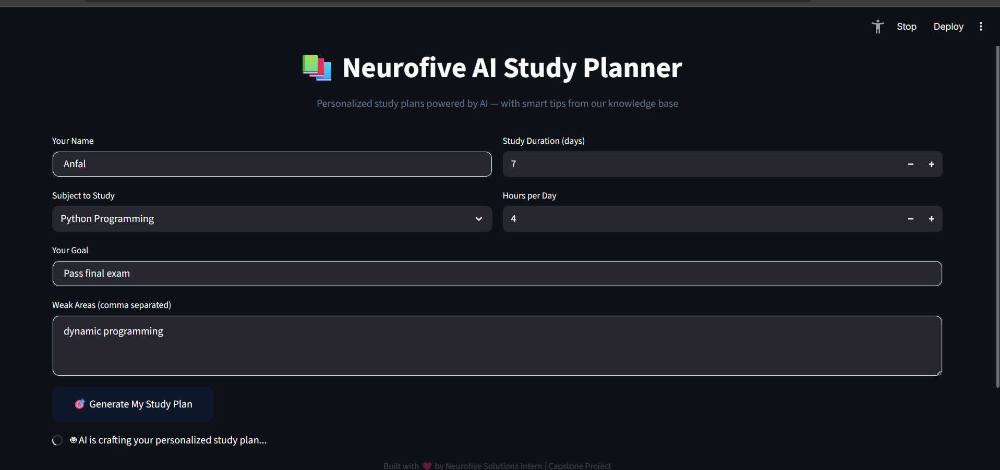
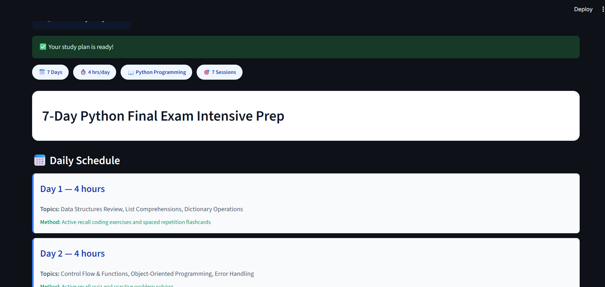

<p align="center">
  
  
  
  
  
</p>

<h1 align="center">📚 Neurofive AI Study Planner</h1>

<p align="center">
  <b>Week 6 Capstone — Full AI-Powered Mini App</b><br>
  Combines everything: Prompt Engineering + Structured Output + RAG + Multi-Agent
</p>

---

## 🎯 Problem Solved

Students waste hours creating study schedules that don't account for their weak areas, available time, or learning style. This app generates **personalized, structured study plans** in seconds using AI.

---

## 🏗️ Architecture


┌─────────────────┐     ┌─────────────────┐     ┌─────────────────┐
│  User Inputs    │────▶│   RAG Lookup   │────▶│  Gemini AI     │
│  (subject,      │     │  (Study Tips    │     │  (Structured    │
│   goals, weak   │     │   Knowledge     │     │   JSON Plan)   │
│   areas)        │     │   Base)         │     │                │
└─────────────────┘     └─────────────────┘     └─────────────────┘
│
┌──────────────────────────┘
▼
┌─────────────────┐
│  Motivation     │
│  Agent          │
└─────────────────┘
│
▼
┌─────────────────┐
│  Beautiful      │
│  Streamlit UI   │
└─────────────────┘


---

## 📸 Screenshot

<p align="center">
  
</p>


<p align="center">
  
</p>

---

## ✨ Features

| Feature | Week | Description |
|:---|:---:|:---|
| 📝 **Smart Input Form** | 1 | Clean user inputs with validation |
| 📋 **Structured JSON Output** | 3 | AI returns valid JSON matching schema |
| 📚 **RAG Knowledge Base** | 3 | Subject-specific study tips from text file |
| 🤖 **Multi-Agent Flow** | 4 | Planner agent + Motivation agent |
| 🎨 **Professional UI** | 5 | Streamlit with custom CSS |
| 📥 **Export JSON** | — | Download plan for offline use |

---

## 🛠️ Tech Stack

| Technology | Purpose |
|:---|:---|
| **Python 3.10+** | Core language |
| **Streamlit** | Web UI |
| **Google Gen AI SDK** | Gemini API |
| **RAG (Custom)** | Text-based knowledge retrieval |
| **JSON Schema** | Structured output validation |

---

## 🚀 Quick Start

```bash
# Clone
git clone https://github.com/yourusername/neurofive-study-planner.git
cd neurofive-study-planner

# Setup
python -m venv venv
venv\Scripts\activate  # Windows
pip install -r requirements.txt

# Configure
copy .env.example .env
# Add your Gemini API key

# Run
streamlit run app.py

🧪 Test Inputs

| #  | Name   | Subject          | Duration | Hours/Day | Goal               | Weak Areas            |
| :- | :----- | :--------------- | :------: | :-------: | :----------------- | :-------------------- |
| 1  | Danyal | Python           |  14 days |     3     | Build a web app    | OOP, decorators, APIs |
| 2  | Sarah  | Machine Learning |  30 days |     4     | Pass certification | Backpropagation, CNNs |
| 3  | Ahmed  | Exam Prep        |  7 days  |     5     | Score 90%+         | Calculus, probability |


📁 Project Structure
plain
neurofive-study-planner/
├── app.py                    # Streamlit UI
├── study_engine.py           # Core AI logic
├── study_tips.txt            # RAG knowledge base
├── requirements.txt
├── .env.example
├── .gitignore
├── README.md
└── screenshots/
    └── dashboard.png

🎓 What I Learned (Capstone Reflection)
This project combined everything from 5 weeks:
Week 1: System prompts and persona design
Week 2: Structured JSON outputs with schema validation
Week 3: RAG — grounding AI in my own knowledge base
Week 4: Multi-agent — separate planner and motivator agents
Week 5: Clean UI/UX for real users
With more time, I'd add: user accounts, progress tracking, and calendar integration.
👤 Author
Neurofive Solutions Intern
Capstone Project — Full AI-Powered Mini App
Built with ❤️ using Python, Streamlit & Google Gemini


