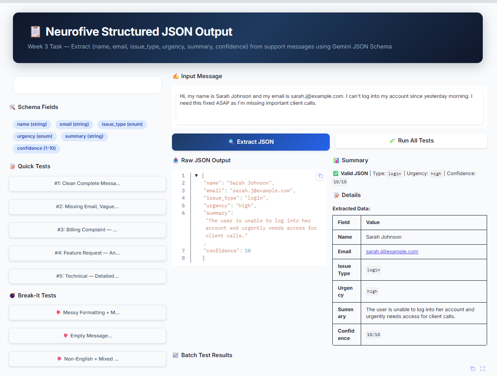

<p align="center">
  
  
  
  
  
</p>

<h1 align="center">📋 Neurofive Solutions — Structured JSON Output</h1>

<p align="center">
  <b>Week 3 Internship Project — Extract Clean JSON From Any Prompt</b><br>
  Force AI to return valid, schema-compliant JSON using Gemini JSON Schema constraints.
</p>

<p align="center">
  <a href="#-what-it-does">What It Does</a> •
  <a href="#-features">Features</a> •
  <a href="#-demo">Demo</a> •
  <a href="#-tech-stack">Tech Stack</a> •
  <a href="#-installation">Installation</a> •
  <a href="#-usage">Usage</a> •
  <a href="#-testing">Testing</a>
</p>

---

## 🎯 What It Does

Real applications don't want paragraphs from AI — they need **clean, predictable data** they can plug into code. This project demonstrates **Structured Outputs** using Google Gemini's JSON Schema feature:

- Define a strict JSON schema (fields, types, enums)
- Send messy customer support messages
- Get back **guaranteed valid JSON** — every single time
- No extra text, no markdown, no hallucinated fields

> **Use Case:** Extract `{name, email, issue_type, urgency, summary, confidence}` from raw support messages automatically.

---

## 📸 Demo Screenshot

<p align="center">
  
</p>
<p align="center"><i>Professional Gradio UI — input messy text, get clean structured JSON instantly</i></p>

---

## ✨ Features

| Feature | Description |
|:---|:---|
| 🔒 **JSON Schema Enforcement** | Gemini API guarantees valid JSON matching your schema |
| 📊 **6 Extracted Fields** | name, email, issue_type, urgency, summary, confidence |
| 🎯 **Enum Constraints** | issue_type & urgency locked to predefined values |
| 🔢 **Confidence Scoring** | AI rates its own extraction accuracy (1–10) |
| 🧪 **Quick Test Buttons** | 5 normal + 3 break-it tests with one click |
| 📈 **Batch Comparison Table** | Side-by-side results for all tests |
| 🛡️ **Hallucination Guard** | Empty fields returned as `""` instead of made-up data |
| 💣 **Break-It Testing** | Emoji-filled, messy, non-English inputs to test robustness |
| 🎨 **Professional UI** | Neurofive branded dark theme with gradient header |

---

## 🛠️ Tech Stack

| Technology | Purpose |
|:---|:---|
| **Python 3.10+** | Core language |
| **Google Gen AI SDK** (`google-genai`) | Gemini API with JSON Schema support |
| **Gradio 6.0** | Professional web interface |
| **python-dotenv** | Secure API key management |
| **JSON Schema** | Structured output constraints |

---

## 📦 Installation

### Prerequisites
- Python 3.10 or higher
- Free [Google AI Studio API Key](https://aistudio.google.com/app/apikey)

### Step 1: Clone
```bash
git clone https://github.com/yourusername/neurofive-structured-json.git
cd neurofive-structured-json
```

### Step 2: Virtual Environment
```bash
python -m venv venv
venv\Scripts ctivate  # Windows
source venv/bin/activate  # macOS/Linux
```

### Step 3: Install
```bash
pip install -r requirements.txt
```

### Step 4: API Key
```bash
copy .env.example .env
notepad .env
```
Add your key:
```env
GEMINI_API_KEY=AIzaSyYourActualKeyHere
```

---

## 🚀 Usage

### Web UI
```bash
python structured_app.py
```
Opens at `http://127.0.0.1:7862`

### CLI Version
```bash
python structured_output.py
```

---

## 🧪 Testing

### Normal Tests
| # | Input Type | What to Check |
|:---|:---|:---|
| 1 | Clean complete message | All fields extracted correctly |
| 2 | Missing email | Email = `""`, rest filled |
| 3 | Angry billing complaint | Urgency = `critical` |
| 4 | Anonymous feature request | Name = `""`, issue_type = `feature_request` |
| 5 | Detailed technical issue | High confidence, accurate summary |

### Break-It Tests
| # | Input Type | Expected Behavior |
|:---|:---|:---|
| T1 | Emoji + messy formatting | Still returns valid JSON |
| T2 | Empty string | Graceful fallback JSON |
| T3 | Non-English (Spanish) | Best-effort extraction, valid JSON |

---

## 📁 Project Structure

```
week-3-structured-output/
├── Dashboard.png                    # 📸 Screenshot of the web UI
├── structured_app.py                # 🌐 Gradio Web Dashboard
├── structured_output.py             # 💻 Command-Line Version
├── requirements.txt                 # Python dependencies
├── .env.example                     # Environment template
├── .gitignore                       # Git ignore rules
└── README.md                        # This file
```

---

## 🔒 Security

- ✅ API key loaded from `.env` — never hardcoded
- ✅ `.env` listed in `.gitignore` — never committed
- ✅ No sensitive data in screenshots

---

## 🐛 Troubleshooting

| Issue | Solution |
|:---|:---|
| `GEMINI_API_KEY not found` | Create `.env` file with your API key |
| `Model not found` | Update `MODEL` in code to `gemini-3.6-flash` or `gemini-3.5-flash` |
| `ModuleNotFoundError` | Run `pip install -r requirements.txt` |
| `Port 7862 in use` | Change `server_port` in `structured_app.py` |

---

## 📄 License

MIT License — free to use, modify, and distribute.

---

## 👤 Author

**Neurofive Solutions Intern**  
Week 3 Task — Structured Outputs & JSON Schema  
Built with ❤️ using Python, Gradio & Google Gemini

---

<p align="center">
  <sub>⭐ Star this repo if you found it helpful!</sub>
</p>
