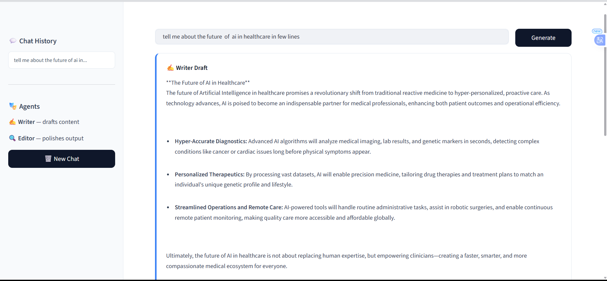
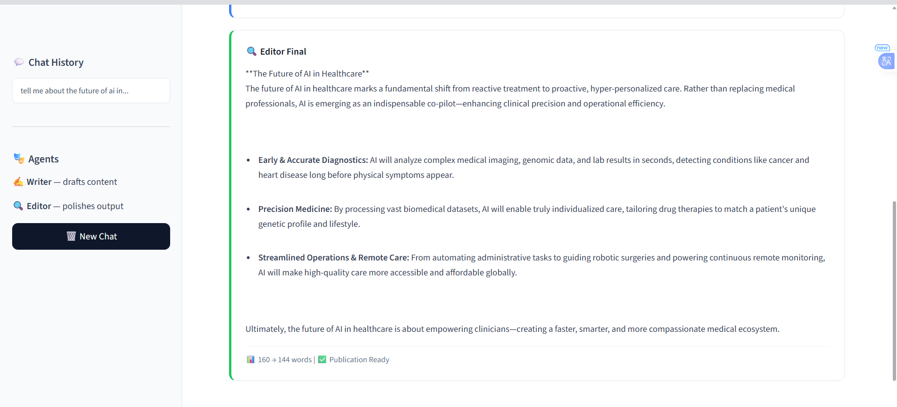

<p align="center">
  
  
  
  
  
</p>

<h1 align="center">🤖🤖 Neurofive Multi-Agent Pipeline</h1>

<p align="center">
  <b>Week 4 Internship Project — Two AI Agents Working Together</b><br>
  Writer drafts content → Editor reviews & polishes → Publication-ready output
</p>

<p align="center">
  <a href="#-what-it-does">What It Does</a> •
  <a href="#-architecture">Architecture</a> •
  <a href="#-features">Features</a> •
  <a href="#-demo">Demo</a> •
  <a href="#-tech-stack">Tech Stack</a> •
  <a href="#-installation">Installation</a> •
  <a href="#-usage">Usage</a>
</p>

---

## 🎯 What It Does

This project demonstrates **Multi-Agent Orchestration** — the biggest shift in AI for 2026. Instead of one prompt → one answer, two specialized AI agents collaborate:

| Agent | Role | Responsibility |
|:---:|:---|:---|
| **✍️ Writer** | Content Creator | Drafts engaging content with intro, key points, and conclusion |
| **🔍 Editor** | Quality Controller | Reviews, improves structure, fixes grammar, strengthens arguments |

> **Pipeline:** Topic → Writer Draft → Editor Review → **Publication-Ready Final**

---

## 🏗️ Architecture

```
┌─────────────┐     ┌─────────────┐     ┌─────────────┐
│   Topic     │────▶│   Writer    │────▶│   Editor    │
│   Input     │     │   Agent     │     │   Agent     │
└─────────────┘     └─────────────┘     └─────────────┘
                                              │
                                              ▼
                                       ┌─────────────┐
                                       │    Final    │
                                       │   Output    │
                                       └─────────────┘
```

---

## 📸 Demo Screenshot

<p align="center">
  
</p>
<p align="center"><i>Streamlit web interface — sidebar with chat history, main area with Writer + Editor outputs</i></p>

<p align="center">
  
</p>
<p align="center"><i>Streamlit web interface — sidebar with chat history, main area with Writer + Editor outputs</i></p>

---

## ✨ Features

| Feature | Description |
|:---|:---|
| 🎭 **Two-Agent Pipeline** | Writer drafts → Editor polishes in sequence |
| 💬 **Chat History Sidebar** | Track all previous topics |
| 🔄 **New Chat Button** | Start fresh conversations |
| 📊 **Word Count Stats** | Compare draft vs final word counts |
| 🎯 **System Prompts** | Each agent has a distinct persona |
| ⚡ **Real-time Generation** | Live loading spinner while agents work |
| 🎨 **Clean UI** | Light theme, professional Streamlit design |
| 📱 **Responsive** | Works on desktop and mobile |

---

## 🛠️ Tech Stack

| Technology | Purpose |
|:---|:---|
| **Python 3.10+** | Core language |
| **Google Gen AI SDK** (`google-genai`) | Gemini API for both agents |
| **Streamlit** | Professional web interface |
| **python-dotenv** | Secure API key management |

---

## 📦 Installation

### Prerequisites
- Python 3.10 or higher
- Free [Google AI Studio API Key](https://aistudio.google.com/app/apikey)

### Step 1: Clone the Repository
```bash
git clone https://github.com/yourusername/neurofive-multi-agent.git
cd neurofive-multi-agent
```

### Step 2: Create Virtual Environment
```bash
python -m venv venv

# Windows
venv\Scripts ctivate

# macOS/Linux
source venv/bin/activate
```

### Step 3: Install Dependencies
```bash
pip install -r requirements.txt
```

### Step 4: Configure API Key
```bash
# Windows
copy .env.example .env
notepad .env
```
Add your Gemini API key:
```env
GEMINI_API_KEY=AIzaSyYourActualKeyHere
```

---

## 🚀 Usage

### Run the Application
```bash
streamlit run multi_agent_streamlit.py
```

The app will open automatically at: `http://localhost:8501`

### How to Use

1. **Enter a topic** in the input field (e.g., "The Future of AI in Healthcare")
2. **Click Generate** or press Enter
3. **Wait** for both agents to work (loading spinner shows progress)
4. **View outputs:**
   - **✍️ Writer Draft** — Raw first draft
   - **🔍 Editor Final** — Polished, publication-ready version
5. **Check stats** — Word count comparison at the bottom

---

## 🧪 Example Topics

| # | Topic | What to Observe |
|:---|:---|:---|
| 1 | "The Future of AI in Healthcare" | Writer introduces ideas → Editor adds depth & structure |
| 2 | "How to Build a Personal Brand on LinkedIn" | Writer lists tips → Editor organizes into actionable steps |
| 3 | "Remote Work: Benefits and Challenges" | Writer covers basics → Editor balances pros/cons better |
| 4 | "Introduction to Python for Beginners" | Writer explains concepts → Editor simplifies for beginners |
| 5 | "Cybersecurity Tips for Small Businesses" | Writer gives general advice → Editor adds specific examples |

---

## 📁 Project Structure

```
neurofive-multi-agent/
├── Dashboard.png                    # 📸 Screenshot of the web UI
├── multi_agent_streamlit.py       # 🌐 Streamlit Web Application
├── requirements.txt                 # Python dependencies
├── .env.example                     # Environment variable template
├── .gitignore                       # Git ignore rules
└── README.md                        # This file
```

---

## 🔒 Security

- ✅ API key loaded from `.env` — never hardcoded
- ✅ `.env` listed in `.gitignore` — never committed
- ✅ No sensitive data in screenshots

---

## 🐛 Troubleshooting

| Issue | Solution |
|:---|:---|
| `GEMINI_API_KEY not found` | Create `.env` file with your API key |
| `ModuleNotFoundError: No module named 'streamlit'` | Run `pip install -r requirements.txt` |
| `Model not found` | Update `MODEL` to `gemini-3.6-flash` or `gemini-3.5-flash` |
| `Streamlit port in use` | Run with `streamlit run app.py --server.port 8502` |

---

## 📄 License

MIT License — free to use, modify, and distribute.

---

## 👤 Author

**Neurofive Solutions Intern**  
Week 4 Task — Multi-Agent Orchestration  
Built with ❤️ using Python, Streamlit & Google Gemini

---

<p align="center">
  <sub>⭐ Star this repo if you found it helpful!</sub>
</p>
